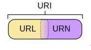
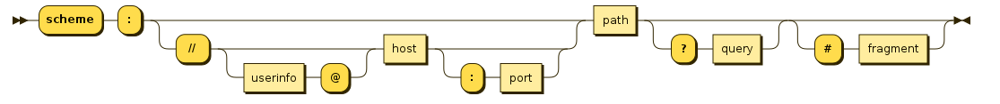
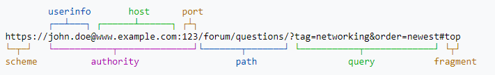

# url中非法字符

> java req params抛异常（`java.lang.IllegalArgumentException: Invalid character found in the request target`），前端请求肯定有问题

## uri url urn

- URI - Uniform Resource Identifier - 统一资源**标识**符
- URL - Uniform Resource Locator - 统一资源**定位**符
- URN - Uniform Resource Name - 统一资源**名称**



```
Uniform Resource Identifier (URI) is a string of characters used to identify a name or a resource on the Internet

A URI identifies a resource either by location, or a name, or both. A URI has two specializations known as URL and URN.[标识]

A Uniform Resource Locator (URL) is a subset of the Uniform Resource Identifier (URI) that specifies where an identified resource is available and the mechanism for retrieving it. A URL defines how the resource can be obtained. It does not have to be HTTP URL (http://), a URL can also be (ftp://) or (smb://).[去哪里找]

A Uniform Resource Name (URN) is a Uniform Resource Identifier (URI) that uses the URN scheme, and does not imply availability of the identified resource. Both URNs (names) and URLs (locators) are URIs, and a particular URI may be both a name and a locator at the same time.[名字]
```


## 格式



```
scheme:[//authority]path[?query][#fragment]

authority = [userinfo@]host[:port]
```

比如:



## url中非法字符 / 特殊字符

```
URL中的特殊字符
	特殊字符	特殊含义	十六进制值 
1.	+	表示空格（在 URL 中不能使用空格）	%20 
2.	/	分隔目录和子目录	%2F 
3.	?	分隔实际的 URL 和参数	%3F 
4.	%	指定特殊字符	%25 
5.	#	表示书签	%23 
6.	&	URL中指定的参数间的分隔符	%26 
7.	=	URL中指定参数的值	%3D

其他奇怪的字符最好就别使用,防止异常
```

## 参考

- https://stackoverflow.com/questions/4913343/what-is-the-difference-between-uri-url-and-urn

- https://en.wikipedia.org/wiki/Uniform_Resource_Identifier

  