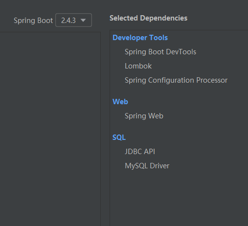

# HTML_CSS_JS_MYSQL_JDBC_CRUD

## New Project




## HTML CSS JS


## MYSQL


## JDBC


## CRUD


## 问题

### springboot首页的问题

- https://www.hangge.com/blog/cache/detail_2528.html

- 静态页面 index.html
- 动态页面 index.html
- 自定义Controller转发特定页面

### Access to XMLHttpRequest at 'http://localhost:12345/user/selectAll' from origin 'http://localhost:63342' has been blocked by CORS policy: No 'Access-Control-Allow-Origin' header is present on the requested resource.

```
前端【63342端口】 -> xhr -> 后端【12345端口】

blocked by CORS policy
```

解决：

