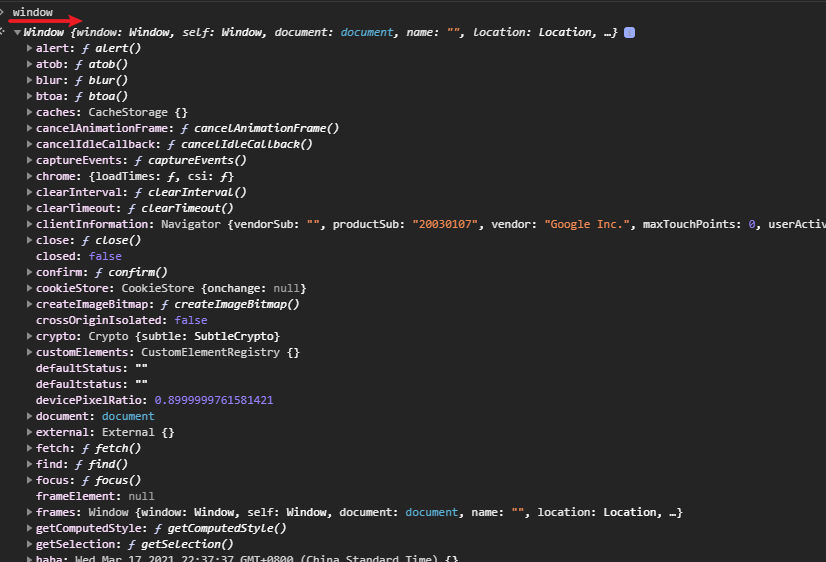
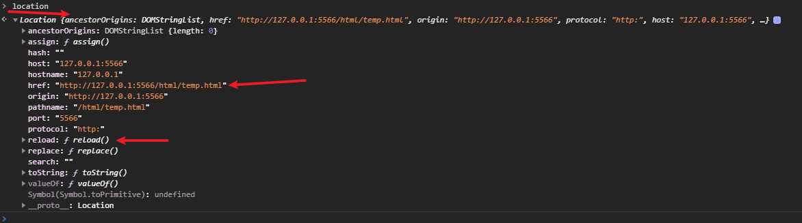
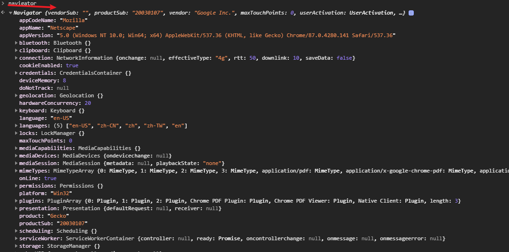
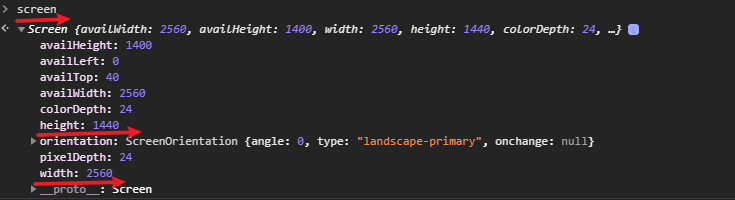
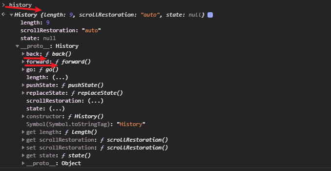

## 1_js跳转url问题_js_BOM【js BOM】

- BOM：Browser Object Model 浏览器对象模型（如果js要在web中使用）
  - js**访问浏览器的接口**
  - ESMAScript规定的**Global对象**【全局对象都可以属于window】【`var test = 10; console.log(window.test);`】
- BOM【可以在chrome console中输入试试看】
  - **window对象【核心】**
  - location对象【导航】
  - navigator对象【浏览器相关信息】
  - screen对象【屏幕】
  - history对象【历史记录】

```
# js打开新页面【window.open(url, "_blank")】
var url = "https://www.baidu.com";
window.open(url, "_blank");

# js跳转页面【window.location.href】
window.location.href = "https://www.baidu.com"; # 常用
location.href = "https://www.baidu.com"; # 这样也行
location.assign("https://www.baidu.com"); # 这样也行

# js重载【reload()】
window.location.reload();

# js历史记录跳转【history.back() / history.forward()】
window.history.back();
window.history.forward();
window.history.go(-1); # back
window.history.forward(1); # forward
window.history.go(-2); # back+back

# 其他操作
window.location.port = 8080;
window.location.search="?q=something"
window.location.pathname="/html/test.html"
...
```

window对象：



location对象：【可以看出来href是变量，reload是函数】



navigator对象：



screen对象：



history对象：



## html a标签跳转target属性

- _self【自己】
- _blank【空白的》全新的页面》新页面】

```
<a href="https://www.baidu.com" target="_self">baidu</a>
<a href="https://www.baidu.com" target="_blank">baidu</a>
```

## js onclick event

```
<button onclick="myFunction()">Click me</button>
```

