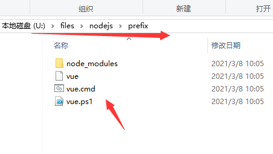

# 1_安装nodejs

## 简介

官网：Node.js® is a JavaScript runtime built on [Chrome's V8 JavaScript engine](https://v8.dev/).

nodejs是**js运行时**【以前js只能在浏览器中运行】【nodejs使得js和操作系统连起来了】

## 安装

### 1. 安装nodejs

nodejs官网：https://nodejs.org/en/

### 2. 修改国内镜像源

```
$ npm config set registry http://registry.npm.taobao.org/
$ npm config set cache "D:\nodejs\cache"
$ npm config set prefix "D:\nodejs\prefix"

$ npm config list # 查看配置
```

备注：然后把 `D:\nodejs\prefix` 添加到env【比如安装了vue-cli，然后你在cmd就可以运行了】



## npm常用命令

> npm是nodejs的包管理

