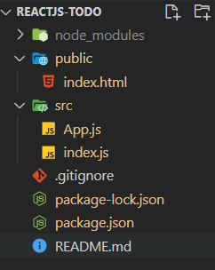

## 工具

- vscode
- nodejs

## 创建项目

```
$ npx create-react-app my-app
```

### 报错

You are running `create-react-app` 4.0.1, which is behind the latest release (4.0.3).

We no longer support global installation of Create React App.

解决错误：[参考](https://stackoverflow.com/questions/64963796/create-react-app-is-not-working-since-version-4-0-1)

```
$ npm uninstall -g create-react-app
```

## 初始结构



```
1. public/index.html > id="root"
2. src/index.js > **react + react-dom** > render(Component, DOM)
```

## readme.md

实现了TODO List的简单js功能

- 见1-todo/reactjs-todo